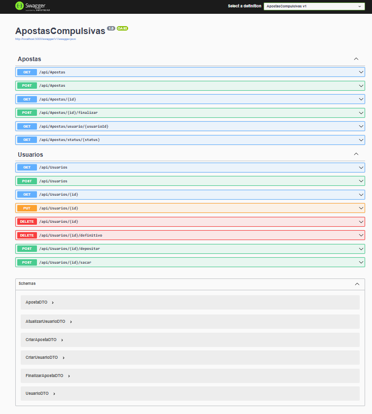
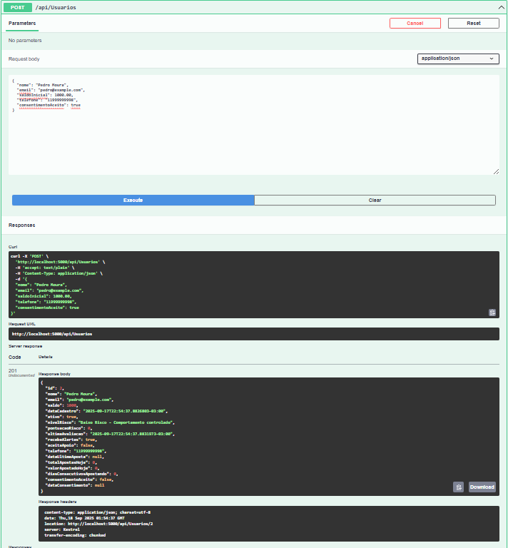
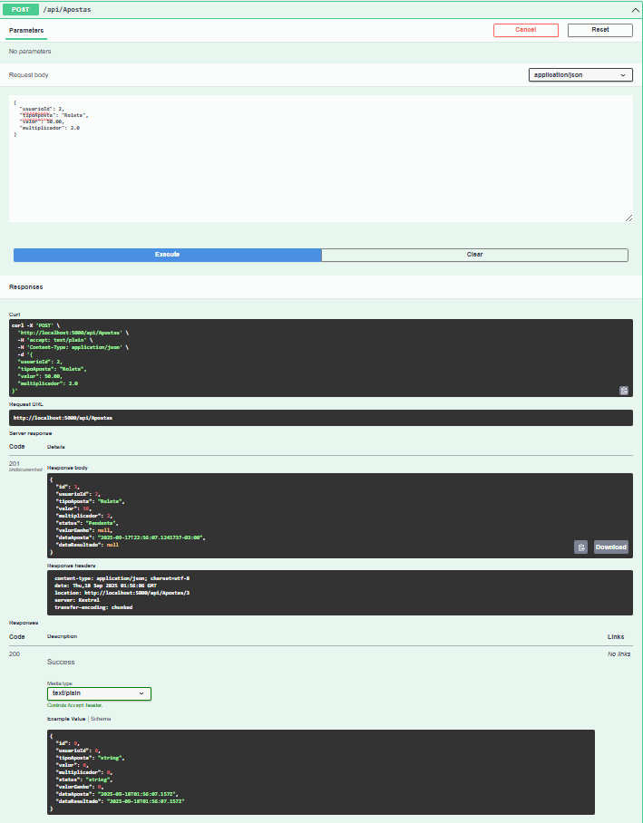

# 🎰 Demonstração do Sistema de Detecção de Apostas Compulsivas

## 🚀 Executando o Sistema

### 1. Compilação
```bash
dotnet build
```

### 2. Execução
```bash
dotnet run
```

### 3. Configuração Inicial
Na primeira execução, o sistema automaticamente:
- Cria o banco de dados SQLite (`apostas.db`)
- Configura todas as tabelas necessárias
- Inicializa a pasta de arquivos para backups
- Exibe o menu principal do sistema

**Desenvolvido por:**
- RM550161 - Eduardo Osorio Filho
- RM550610 - Fabio Hideki Kamikihara  
- RM550260 - Pedro Moura Barros
- RM98896 - Rodrigo Fernandes dos Santos

---

## 📱 Exemplo de Uso Completo

### Passo 1: Cadastrar Usuários
```
🎰 ================================================
    SISTEMA DE APOSTAS COMPULSIVAS - CHALLENGE XP
==================================================

1. 👤 Gerenciar Usuários
2. 🎲 Gerenciar Apostas
3. 📊 Relatórios e Histórico
4. 💾 Backup e Restauração
5. ⚙️  Configurações
0. 🚪 Sair
...
```

### Passo 2: Realizar Apostas
```
Escolha uma opção: 2
...
```

### Passo 3: Finalizar Apostas
```
Escolha uma opção: 4
...
```

### Passo 4: Ver Relatórios
```
Escolha uma opção: 3
...
```

### Passo 5: Fazer Backup
```
Escolha uma opção: 4
...
```

---

## 📁 Arquivos Gerados

Após a execução, você encontrará:

### Banco de Dados
- `apostas.db` - Banco SQLite com todas as tabelas


---

## 🎯 Funcionalidades Demonstradas

### ✅ CRUD Completo
- **Create**: Cadastro de usuários e apostas
- **Read**: Listagem, busca e consultas
- **Update**: Edição de usuários e finalização de apostas
- **Delete**: Desativação de usuários

### ✅ Banco de Dados SQLite
- Tabelas criadas automaticamente
- Relacionamentos entre entidades
- Transações e integridade referencial

### ✅ Manipulação de Arquivos
- Exportação em formato TXT
- Exportação em formato JSON
- Backup completo do sistema

### ✅ Interface Console
- Menu interativo e intuitivo
- Validação de entrada de dados
- Feedback visual para o usuário

### ✅ Relatórios e Estatísticas
- Relatórios por usuário
- Relatórios por período
- Estatísticas financeiras
- Histórico completo de operações

---

## 🔧 Comandos Úteis

### Compilar e Executar
```bash
# Compilar
dotnet build

# Executar
dotnet run

# Executar em modo release
dotnet run --configuration Release
```

### Limpar e Recompilar
```bash
# Limpar
dotnet clean

# Restaurar dependências
dotnet restore

# Recompilar
dotnet build
```

---

## 📊 Estrutura do Banco de Dados

### Tabela Usuarios
| Campo | Tipo | Descrição |
|-------|------|-----------|
| Id | INTEGER | Chave primária |
| Nome | TEXT | Nome do usuário |
| Email | TEXT | Email único |
| Saldo | DECIMAL(10,2) | Saldo atual |
| DataCadastro | DATETIME | Data de cadastro |
| Ativo | BOOLEAN | Status do usuário |

### Tabela Apostas
| Campo | Tipo | Descrição |
|-------|------|-----------|
| Id | INTEGER | Chave primária |
| UsuarioId | INTEGER | FK para Usuarios |
| TipoAposta | TEXT | Tipo da aposta |
| Valor | DECIMAL(10,2) | Valor apostado |
| Multiplicador | DECIMAL(5,2) | Multiplicador de ganho |
| Status | TEXT | Pendente/Ganhou/Perdeu |
| ValorGanho | DECIMAL(10,2) | Valor ganho |
| DataAposta | DATETIME | Data da aposta |
| DataResultado | DATETIME | Data do resultado |

### Tabela Historico
| Campo | Tipo | Descrição |
|-------|------|-----------|
| Id | INTEGER | Chave primária |
| UsuarioId | INTEGER | FK para Usuarios |
| TipoOperacao | TEXT | Tipo da operação |
| Valor | DECIMAL(10,2) | Valor da operação |
| Descricao | TEXT | Descrição da operação |
| DataOperacao | DATETIME | Data da operação |
| SaldoAnterior | DECIMAL(10,2) | Saldo antes |
| SaldoPosterior | DECIMAL(10,2) | Saldo depois |

---

## 🌐 Modo API (Swagger)

Além do modo console, o sistema também pode ser executado como uma **API REST com Swagger**.

### 🖥️ Tela Inicial do Swagger


---

### 👤 Criando um Usuário (POST /api/usuarios)
Clique em **Try it out**, preencha os dados e clique em **Execute**.

```json
{
  "nome": "Pedro Moura",
  "email": "pedro@email.com",
  "saldoInicial": 1000.00,
  "telefone": "11999999999",
  "consentimentoAceito": true
}
```

📸 Resultado:


---

### 🎲 Criando uma Aposta (POST /api/apostas)
Clique em **Try it out**, preencha os dados e clique em **Execute**.

```json
{
  "usuarioId": 2,
  "tipoAposta": "Roleta",
  "valor": 50.00,
  "multiplicador": 2.0
}
```

📸 Resultado:


---

**🚀 Pronto para uso e avaliação!**
