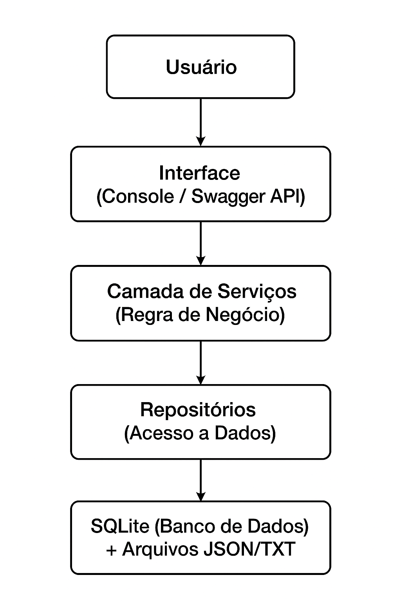

# 🎰 Sistema de Detecção de Apostas Compulsivas - Challenge XP

## 📋 Sobre o Projeto

Este sistema foi desenvolvido como parte do Challenge XP - Case 1, focado na detecção, inibição e tratamento de comportamentos compulsivos relacionados a apostas. A solução utiliza algoritmos de análise comportamental para identificar padrões de risco e oferecer intervenções personalizadas aos usuários.

**Desenvolvido por:**
- RM550161 - Eduardo Osorio Filho
- RM550610 - Fabio Hideki Kamikihara  
- RM550260 - Pedro Moura Barros
- RM98896 - Rodrigo Fernandes dos Santos

---

## 🏗️ Arquitetura

O projeto segue o padrão de arquitetura em camadas (Layered Architecture):

```
📁 ApostasCompulsivas/
├── 📁 Models/           # Entidades do domínio
│   ├── Usuario.cs
│   ├── Aposta.cs
│   └── Historico.cs
├── 📁 Repository/       # Camada de acesso a dados
│   ├── DatabaseContext.cs
│   ├── IUsuarioRepository.cs
│   ├── UsuarioRepository.cs
│   ├── IApostaRepository.cs
│   ├── ApostaRepository.cs
│   ├── IHistoricoRepository.cs
│   └── HistoricoRepository.cs
├── 📁 Services/         # Camada de regras de negócio
│   ├── IUsuarioService.cs
│   ├── UsuarioService.cs
│   ├── IApostaService.cs
│   ├── ApostaService.cs
│   ├── IHistoricoService.cs
│   ├── HistoricoService.cs
│   ├── IFileService.cs
│   └── FileService.cs
├── 📁 Controllers/      # Controladores da API
├── 📁 Middleware/       # Tratamento global de exceções
├── 📁 diagramas/        # Diagramas e prints do Swagger
├── 📁 Arquivos/          # Pasta para arquivos de backup
├── Program.cs           # Interface console principal
├── ServiceCollectionExtensions.cs
├── ApostasCompulsivas.csproj
└── README.md
```

---

## 🖼️ Fluxo Geral do Sistema



---

## 🚀 Principais Funcionalidades

### 🔍 Detecção de Comportamentos Compulsivos
- Análise automática de padrões de apostas
- Identificação de comportamentos de risco
- Classificação de usuários por nível de risco
- Detecção de apostas frequentes, noturnas e consecutivas

### ⚠️ Sistema de Intervenções
- Alertas personalizados baseados no comportamento
- Sugestões de atividades alternativas
- Limites automáticos de apostas
- Pausas obrigatórias para usuários em risco

### 🎯 Atividades Alternativas
- Base de dados com atividades saudáveis
- Sugestões personalizadas por perfil do usuário
- Categorias: esportes, artes, educação, voluntariado

### 📊 Relatórios Comportamentais
- Relatórios por usuário e por período
- Estatísticas financeiras e de apostas
- Histórico completo de operações

### 👤 Gerenciamento de Usuários
- Cadastro, edição, busca e exclusão
- Monitoramento contínuo do comportamento
- Histórico completo de operações

### 💾 Backup e Exportação
- Backup completo em JSON
- Exportação de relatórios em TXT e JSON

---

## 🛠️ Tecnologias Utilizadas

- **.NET 8.0** - Framework principal
- **SQLite** - Banco de dados local
- **Newtonsoft.Json** - Serialização JSON
- **System.Data.SQLite** - Driver SQLite para .NET
- **Swashbuckle.AspNetCore** - Geração automática do Swagger

---

## 📦 Dependências

```xml
<PackageReference Include="System.Data.SQLite" Version="1.0.118" />
<PackageReference Include="Newtonsoft.Json" Version="13.0.3" />
<PackageReference Include="Swashbuckle.AspNetCore" Version="6.5.0" />
```

---

## 🚀 Como Executar

### 📍 Console (modo padrão)
```bash
dotnet run
```

### 🌐 API com Swagger
```bash
dotnet run -- --api
```

Depois acesse no navegador:
```
http://localhost:5000/swagger
```

---

## 📱 Interface do Sistema (Console)

### Menu Principal
```
🎰 ================================================
    SISTEMA DE APOSTAS COMPULSIVAS - CHALLENGE XP
==================================================

1. 👤 Gerenciar Usuários
2. 🎲 Gerenciar Apostas
3. 📊 Relatórios e Histórico
4. 💾 Backup e Restauração
5. ⚙️  Configurações
0. 🚪 Sair
```

---

## 🌐 Interface da API (Swagger)

### 🖥️ Tela Inicial


### 👤 Criando um Usuário
```json
{
  "nome": "Pedro Moura",
  "email": "pedro@email.com",
  "saldoInicial": 1000.00,
  "telefone": "11999999999",
  "consentimentoAceito": true
}
```


### 🎲 Criando uma Aposta
```json
{
  "usuarioId": 1,
  "tipoAposta": "Roleta",
  "valor": 50.00,
  "multiplicador": 2.0
}
```


---

## 🗄️ Estrutura do Banco de Dados

### Usuarios
| Campo | Tipo |
|---|---|
| Id | INTEGER |
| Nome | TEXT |
| Email | TEXT |
| Saldo | DECIMAL(10,2) |
| DataCadastro | DATETIME |
| Ativo | BOOLEAN |

### Apostas
| Campo | Tipo |
|---|---|
| Id | INTEGER |
| UsuarioId | INTEGER |
| TipoAposta | TEXT |
| Valor | DECIMAL(10,2) |
| Multiplicador | DECIMAL(5,2) |
| Status | TEXT |
| ValorGanho | DECIMAL(10,2) |
| DataAposta | DATETIME |
| DataResultado | DATETIME |

### Historico
| Campo | Tipo |
|---|---|
| Id | INTEGER |
| UsuarioId | INTEGER |
| TipoOperacao | TEXT |
| Valor | DECIMAL(10,2) |
| Descricao | TEXT |
| DataOperacao | DATETIME |
| SaldoAnterior | DECIMAL(10,2) |
| SaldoPosterior | DECIMAL(10,2) |

---

## 🎯 Critérios de Avaliação Atendidos

- ✅ CRUD completo com SQLite
- ✅ Interface Console funcional
- ✅ API REST com Swagger
- ✅ Arquitetura em camadas
- ✅ Documentação completa
- ✅ Código limpo e comentado

**🎉 Projeto pronto para avaliação!**
